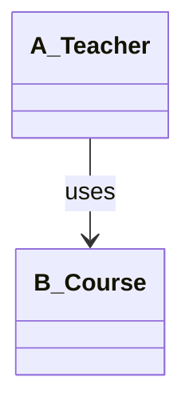
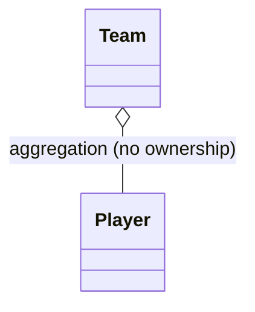
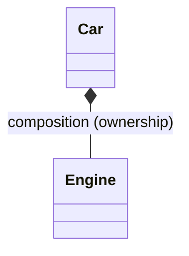
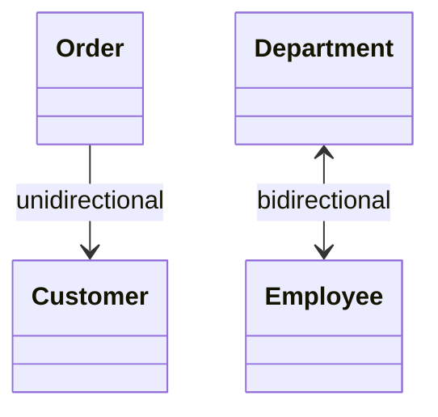

# Asociación, Agregación y Composición en POO (C++98)

Este documento resume de forma práctica las diferencias entre asociación, agregación y composición, y qué significan relaciones unidireccionales y bidireccionales. Explicaciones en castellano; código en inglés (C++98).

## 📌 Definiciones rápidas
- **Asociación**: Relación de colaboración ("usa a"). No hay relación de vida. Los objetos existen por separado.
- **Agregación**: Relación "tiene un" débil. El contenedor conoce elementos que NO son de su propiedad (no controla su vida).
- **Composición**: Relación "está compuesto por" fuerte. El contenedor ES dueño; su vida y la de las partes están ligadas.

## 🔀 Unidireccional vs Bidireccional
- **Unidireccional**: Solo un lado conoce al otro (A → B).
- **Bidireccional**: Ambos lados se conocen (A ↔ B). Úsalo con cuidado para evitar acoplamiento excesivo y ciclos.

---

## 1) Asociación (colaboración sin ownership)
- Vida independiente; no hay responsabilidad de destrucción.
- Suele aparecer como parámetros de funciones o miembros no propietarios.

```cpp
// Association: Teacher uses Course (no ownership)
class Course { /* ... */ };

class Teacher {
public:
    void assignCourse(Course& course); // uses; does not own
};
```

ASCII UML:
```
Teacher ────> Course   (asociación unidireccional)
```

Cuándo usarla:
- Servicios puntuales, dependencias ligeras, colaboración temporal.

---

## 2) Agregación (tiene-un, sin ownership)
- El contenedor referencia objetos creados/gestionados fuera.
- Si el contenedor muere, los elementos pueden seguir existiendo.

```cpp
// Aggregation: Team references Player (no ownership)
#include <vector>

class Player { /* ... */ };

class Team {
private:
    std::vector<Player*> players; // no ownership
public:
    void addPlayer(Player* p) { players.push_back(p); }
    // Team does not delete Player*
};
```

ASCII UML:
```
Team ◇───> Player   (rombo blanco: agregación)
```

Cuándo usarla:
- Catálogos compartidos, objetos gestionados por otra capa/fábrica.

Riesgos:
- Duplicación de punteros, referencias colgantes si el "dueño real" destruye primero.

---

## 3) Composición (está-compuesto-por, con ownership)
- El todo crea/posee las partes. Vida ligada: al destruir el todo, se destruyen las partes.

```cpp
// Composition: Car owns Engine (lifetime tied)
class Engine { /* ... */ };

class Car {
private:
    Engine engine;   // owned; destroyed with Car
public:
    Car() : engine() {}
};
```

ASCII UML:
```
Car ◆───> Engine   (rombo negro: composición)
```

Cuándo usarla:
- Partes internas esenciales, exclusivas y con el mismo ciclo de vida.

Ventajas:
- Invariante de propiedad clara; evita fugas y punteros colgantes.

---

## 4) Unidireccional vs Bidireccional (detalle)

### Unidireccional
- Más simple, menor acoplamiento, más fácil de testear.

```cpp
// Unidirectional: Order knows Customer; Customer does not know Order
class Customer { /* ... */ };

class Order {
private:
    Customer* customer; // Order -> Customer
public:
    explicit Order(Customer* c) : customer(c) {}
};
```

### Bidireccional
- Útil si ambos necesitan consultar/actualizar al otro.
- Coordina con cuidado para evitar inconsistencias/ciclos.

```cpp
// Bidirectional: Department <-> Employee
#include <vector>

class Department; // forward decl

class Employee {
private:
    Department* dept;
public:
    Employee() : dept(0) {}
    void setDepartment(Department* d) { dept = d; }
};

class Department {
private:
    std::vector<Employee*> staff;
public:
    void add(Employee* e) { staff.push_back(e); e->setDepartment(this); }
};
```

ASCII UML:
```
Department <────> Employee   (bidireccional)
```

Recomendación:
- Prefiere unidireccional por defecto; hazlo bidireccional solo si aporta valor real en ambos sentidos.

---

## 5) Checklist de diseño rápido
- ¿El "todo" controla creación/destrucción de las partes?
  - Sí → Composición
  - No → Agregación (si las "tiene"), o Asociación (si solo colabora/pasa por parámetros)
- ¿Ambos lados necesitan referenciarse?
  - Evita la bidireccionalidad si puedes; considera un mediador/servicio.
- ¿Quién es responsable de `delete` en C++98?
  - En agregación/asociación con punteros, documenta el ownership para evitar fugas.

---

## 6) Buenas prácticas C++98
- Usa objetos por valor para composición cuando sea posible (miembros directos).
- En agregación/asociación, documenta ownership y ciclo de vida si usas `T*`.
- Evita ciclos de inclusión: usa forward declarations en headers y `#include` en `.cpp`.
- Mantén dependencias mínimas; favorece interfaces claras.

---

## 7) Mini-resumen (1 línea cada una)
- Asociación: colabora, sin ownership.
- Agregación: tiene-un, sin ownership (vida independiente).
- Composición: está-compuesto-por, con ownership (vida ligada).
- Unidireccional: A conoce B.
- Bidireccional: A y B se conocen.

---

## 📊 Diagramas UML (Mermaid + ASCII)

### Asociación (Association)

ASCII:
```
A_Teacher ────> B_Course   (asociación unidireccional)
```

### Agregación (Aggregation)

ASCII:
```
Team ◇───> Player   (rombo blanco: agregación)
```

### Composición (Composition)

ASCII:
```
Car ◆───> Engine   (rombo negro: composición)
```

### Unidireccional vs Bidireccional

ASCII:
```
Order ────> Customer        (unidireccional)
Department <────> Employee  (bidireccional)
```
