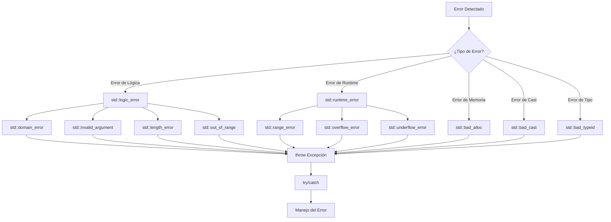

# 🏗️ DIAGRAMA DE JERARQUÍA DE EXCEPCIONES ESTÁNDAR DE C++

## 📋 Jerarquía Completa de `std::exception`

Este documento presenta la jerarquía completa de las excepciones estándar de C++, incluyendo diagramas visuales y explicaciones detalladas.

---

## 🎯 Diagrama Principal de la Jerarquía

```mermaid
classDiagram
    class std_exception {
        <<abstract>>
        +what() const char* throw()
    }
    
    class std_logic_error {
        +what() const char* throw()
    }
    
    class std_runtime_error {
        +what() const char* throw()
    }
    
    class std_domain_error {
        +what() const char* throw()
    }
    
    class std_invalid_argument {
        +what() const char* throw()
    }
    
    class std_length_error {
        +what() const char* throw()
    }
    
    class std_out_of_range {
        +what() const char* throw()
    }
    
    class std_range_error {
        +what() const char* throw()
    }
    
    class std_overflow_error {
        +what() const char* throw()
    }
    
    class std_underflow_error {
        +what() const char* throw()
    }
    
    class std_bad_alloc {
        +what() const char* throw()
    }
    
    class std_bad_cast {
        +what() const char* throw()
    }
    
    class std_bad_typeid {
        +what() const char* throw()
    }
    
    class std_bad_exception {
        +what() const char* throw()
    }
    
    %% Herencia principal
    std_exception <|-- std_logic_error
    std_exception <|-- std_runtime_error
    std_exception <|-- std_bad_alloc
    std_exception <|-- std_bad_cast
    std_exception <|-- std_bad_typeid
    std_exception <|-- std_bad_exception
    
    %% Herencia de logic_error
    std_logic_error <|-- std_domain_error
    std_logic_error <|-- std_invalid_argument
    std_logic_error <|-- std_length_error
    std_logic_error <|-- std_out_of_range
    
    %% Herencia de runtime_error
    std_runtime_error <|-- std_range_error
    std_runtime_error <|-- std_overflow_error
    std_runtime_error <|-- std_underflow_error
```



---

## 📊 Diagrama de Árbol ASCII

```
std::exception
├── std::logic_error
│   ├── std::domain_error
│   ├── std::invalid_argument
│   ├── std::length_error
│   └── std::out_of_range
├── std::runtime_error
│   ├── std::range_error
│   ├── std::overflow_error
│   └── std::underflow_error
├── std::bad_alloc
├── std::bad_cast
├── std::bad_typeid
└── std::bad_exception
```

---

## 🔍 Descripción Detallada de Cada Excepción

### 🎯 **Clase Base: `std::exception`**
- **Propósito**: Clase base abstracta para todas las excepciones estándar
- **Método virtual puro**: `virtual const char* what() const throw()`
- **Uso**: Siempre heredar de esta clase para excepciones personalizadas

### 🧠 **Excepciones de Lógica (`std::logic_error`)**

#### `std::domain_error`
- **Cuándo se lanza**: Error en el dominio matemático
- **Ejemplo**: `std::sqrt(-1)` (raíz cuadrada de número negativo)
- **Uso típico**: Operaciones matemáticas con parámetros inválidos

#### `std::invalid_argument`
- **Cuándo se lanza**: Argumento de función inválido
- **Ejemplo**: `std::stoi("abc")` (string no numérico)
- **Uso típico**: Validación de parámetros de entrada

#### `std::length_error`
- **Cuándo se lanza**: Longitud excede límites
- **Ejemplo**: `std::string s(1000000000, 'a')` (string demasiado largo)
- **Uso típico**: Contenedores que exceden su capacidad máxima

#### `std::out_of_range`
- **Cuándo se lanza**: Índice fuera de rango
- **Ejemplo**: `std::vector<int> v; v.at(10)` (acceso fuera de límites)
- **Uso típico**: Acceso a elementos de contenedores

### ⚡ **Excepciones de Runtime (`std::runtime_error`)**

#### `std::range_error`
- **Cuándo se lanza**: Error de rango en operaciones
- **Ejemplo**: Resultado fuera del rango representable
- **Uso típico**: Cálculos que producen valores fuera de rango

#### `std::overflow_error`
- **Cuándo se lanza**: Desbordamiento aritmético
- **Ejemplo**: `INT_MAX + 1` en operaciones aritméticas
- **Uso típico**: Operaciones que exceden la capacidad del tipo

#### `std::underflow_error`
- **Cuándo se lanza**: Subdesbordamiento aritmético
- **Ejemplo**: Resultado muy pequeño para ser representado
- **Uso típico**: Operaciones que producen valores subnormales

### 🚫 **Excepciones del Sistema**

#### `std::bad_alloc`
- **Cuándo se lanza**: Fallo en asignación de memoria
- **Ejemplo**: `new int[10000000000]` (memoria insuficiente)
- **Uso típico**: Operador `new` cuando no hay memoria disponible

#### `std::bad_cast`
- **Cuándo se lanza**: Fallo en `dynamic_cast`
- **Ejemplo**: `dynamic_cast<Derived*>(base_ptr)` cuando no es posible
- **Uso típico**: Conversiones de tipos en tiempo de ejecución

#### `std::bad_typeid`
- **Cuándo se lanza**: `typeid` aplicado a puntero nulo
- **Ejemplo**: `typeid(*nullptr)`
- **Uso típico**: Información de tipos con punteros nulos

#### `std::bad_exception`
- **Cuándo se lanza**: Excepción no manejada en `unexpected()`
- **Ejemplo**: Cuando `unexpected()` no puede manejar una excepción
- **Uso típico**: Mecanismo de seguridad para excepciones no esperadas

---

## 🎨 Diagrama de Flujo de Uso



---

## 💻 Ejemplos de Uso Práctico

### Ejemplo 1: Excepciones de Lógica
```cpp
#include <iostream>
#include <stdexcept>
#include <vector>
#include <string>

void ejemplo_logic_errors() {
    try {
        // std::invalid_argument
        std::stoi("abc");
    } catch (const std::invalid_argument& e) {
        std::cout << "Argumento inválido: " << e.what() << std::endl;
    }
    
    try {
        // std::out_of_range
        std::vector<int> v(5);
        v.at(10); // Acceso fuera de rango
    } catch (const std::out_of_range& e) {
        std::cout << "Fuera de rango: " << e.what() << std::endl;
    }
    
    try {
        // std::length_error
        std::string s(1000000000, 'a'); // String demasiado largo
    } catch (const std::length_error& e) {
        std::cout << "Longitud excesiva: " << e.what() << std::endl;
    }
}
```

### Ejemplo 2: Excepciones de Runtime
```cpp
void ejemplo_runtime_errors() {
    try {
        // std::overflow_error
        int max_int = INT_MAX;
        int result = max_int + 1; // Desbordamiento
    } catch (const std::overflow_error& e) {
        std::cout << "Desbordamiento: " << e.what() << std::endl;
    }
    
    try {
        // std::range_error
        double value = std::sqrt(-1.0); // Resultado no válido
    } catch (const std::range_error& e) {
        std::cout << "Rango inválido: " << e.what() << std::endl;
    }
}
```

### Ejemplo 3: Excepciones del Sistema
```cpp
void ejemplo_system_errors() {
    try {
        // std::bad_alloc
        int* huge_array = new int[10000000000]; // Memoria insuficiente
    } catch (const std::bad_alloc& e) {
        std::cout << "Memoria insuficiente: " << e.what() << std::endl;
    }
    
    try {
        // std::bad_cast
        Base* base_ptr = new Base();
        Derived* derived_ptr = dynamic_cast<Derived*>(base_ptr);
        if (!derived_ptr) {
            throw std::bad_cast();
        }
    } catch (const std::bad_cast& e) {
        std::cout << "Cast fallido: " << e.what() << std::endl;
    }
}
```

---

## 🎯 Mejores Prácticas

### ✅ **Cuándo usar cada tipo de excepción**

1. **`std::logic_error`**: Errores que se pueden detectar antes de la ejecución
2. **`std::runtime_error`**: Errores que solo se pueden detectar durante la ejecución
3. **`std::bad_alloc`**: Problemas de memoria (automático con `new`)
4. **`std::bad_cast`**: Fallos en conversiones de tipos
5. **Excepciones personalizadas**: Heredar de `std::exception`

### 🔧 **Patrón de Captura Recomendado**

```cpp
try {
    // Código que puede lanzar excepciones
    operacion_peligrosa();
}
catch (const std::logic_error& e) {
    // Manejo específico para errores de lógica
    std::cerr << "Error de lógica: " << e.what() << std::endl;
}
catch (const std::runtime_error& e) {
    // Manejo específico para errores de runtime
    std::cerr << "Error de runtime: " << e.what() << std::endl;
}
catch (const std::bad_alloc& e) {
    // Manejo específico para problemas de memoria
    std::cerr << "Memoria insuficiente: " << e.what() << std::endl;
}
catch (const std::exception& e) {
    // Captura cualquier otra excepción estándar
    std::cerr << "Error general: " << e.what() << std::endl;
}
catch (...) {
    // Captura cualquier excepción no estándar
    std::cerr << "Error desconocido" << std::endl;
}
```

---

## 📚 Referencias y Recursos

- **ISO/IEC 14882:1998** - Estándar C++98
- **cppreference.com** - Documentación completa de excepciones
- **Stroustrup, Bjarne** - "The C++ Programming Language"
- **Meyers, Scott** - "Effective C++"

---

## 🎯 Resumen

La jerarquía de excepciones de C++ está diseñada para proporcionar un sistema robusto y jerárquico de manejo de errores. Comprender esta jerarquía es fundamental para:

1. **Elegir la excepción correcta** para cada situación
2. **Capturar excepciones de manera eficiente** usando la herencia
3. **Diseñar excepciones personalizadas** que sigan las convenciones estándar
4. **Mantener código limpio y mantenible** con manejo de errores apropiado

> **Nota**: Este diagrama representa la jerarquía estándar de C++98. En versiones posteriores (C++11, C++14, C++17, C++20, C++23) se han añadido nuevas excepciones, pero la estructura base permanece igual.
