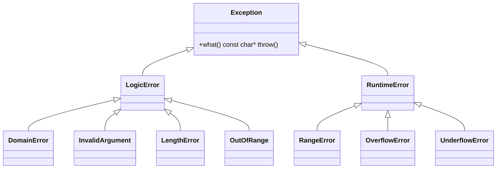
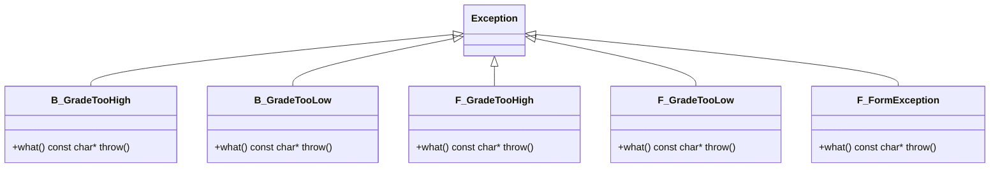

# EXCEPCIONES EN C++ (CPP05) – FUNDAMENTOS Y USO EN EL PROYECTO

## 📚 ¿Qué es una excepción en C++?
- Una excepción representa una condición anómala que ocurre en tiempo de ejecución.
- El flujo de control se desvía mediante `throw` y se maneja con `try/catch`.
- En C++98, la especificación de excepciones para funciones que no lanzan se declara con `throw()`.

```cpp
try {
    // code that may throw
} catch (const std::exception& e) {
    std::cout << e.what() << std::endl;
}
```

## 🧩 Jerarquía estándar de excepciones (C++98)

Nota sobre Mermaid: algunos visores fallan con nombres que incluyen `std::` y `::`. Abajo uso identificadores simples y agrego una leyenda con el mapeo a los tipos reales de C++.



Leyenda (mapa a C++ real):
- `Exception` → `std::exception`
- `LogicError` → `std::logic_error`
- `RuntimeError` → `std::runtime_error`
- `DomainError` → `std::domain_error`
- `InvalidArgument` → `std::invalid_argument`
- `LengthError` → `std::length_error`
- `OutOfRange` → `std::out_of_range`
- `RangeError` → `std::range_error`
- `OverflowError` → `std::overflow_error`
- `UnderflowError` → `std::underflow_error`

Alternativa ASCII (fallback):
```
std::exception
├─ std::logic_error
│  ├─ std::domain_error
│  ├─ std::invalid_argument
│  ├─ std::length_error
│  └─ std::out_of_range
└─ std::runtime_error
   ├─ std::range_error
   ├─ std::overflow_error
   └─ std::underflow_error
```

## 🏛️ Excepciones específicas del proyecto (CPP05)

En este proyecto definimos excepciones personalizadas dentro de las clases. Todas heredan de `std::exception` y sobreescriben `what()`.



Leyenda (mapa a C++ real):
- `Exception` → `std::exception`
- `B_GradeTooHigh` → `Bureaucrat::GradeTooHighException`
- `B_GradeTooLow` → `Bureaucrat::GradeTooLowException`
- `F_GradeTooHigh` → `Form::GradeTooHighException`
- `F_GradeTooLow` → `Form::GradeTooLowException`
- `F_FormException` → `Form::FormException`

Alternativa ASCII (fallback):
```
std::exception
├─ Bureaucrat::GradeTooHighException
├─ Bureaucrat::GradeTooLowException
├─ Form::GradeTooHighException
├─ Form::GradeTooLowException
└─ Form::FormException
```

## 🔧 Cómo usamos las excepciones personalizadas

- Validamos al construir o modificar estado:
```cpp
if (grade < 1) throw GradeTooHighException();
if (grade > 150) throw GradeTooLowException();
```

- Comprobaciones previas a ejecutar formularios:
```cpp
if (!getSigned()) throw Form::FormException();
if (executor.getGrade() > getGradeToExecute()) throw Form::GradeTooLowException();
```

- Captura en los límites (métodos de `Bureaucrat`) para informar claramente:
```cpp
try {
    form.beSigned(*this);
    std::cout << _name << " signed " << form.getName() << std::endl;
} catch (const std::exception& e) {
    std::cout << _name << " couldn't sign " << form.getName()
              << " because " << e.what() << std::endl;
}
```

## 🧠 Notas técnicas (C++98)
- `what()` debe declararse como `virtual const char* what() const throw();`.
- Lanza por valor y captura por referencia constante (`catch (const X& e)`).
- Evita lanzar desde destructores; si es inevitable, captura dentro del destructor para no propagar.
- Mantén las clases de excepción ligeras (sin miembros pesados ni asignaciones dinámicas).

## 🧪 Cómo probar las excepciones
- Construye `Bureaucrat` con valores límite (1 y 150) y valores fuera de rango.
- Intenta ejecutar un `Form` sin firmar: debe lanzar `FormException`.
- Intenta ejecutar con un grade insuficiente: debe lanzar `GradeTooLowException`.
- Verifica mensajes de `what()` para que sean claros y útiles.

## ✅ Buenas prácticas
- Mensajes de `what()` cortos y claros (en inglés para coherencia con el código).
- Valida condiciones en el punto de origen (constructores, setters, operaciones críticas).
- Lanza cerca de la causa; captura en capas superiores (puntos de entrada, UI, main, o métodos “orquestadores”).
- Evita asignaciones dinámicas en rutas de manejo de errores.

## 🗂️ Archivos del proyecto relacionados
- `ex02/` y `ex03/` usan intensivamente estas excepciones.
- Revisa `Bureaucrat.hpp/.cpp`, `Form.hpp/.cpp`, y cada `...Form.hpp/.cpp` derivado para ver los lanzamientos (`throw`) y capturas (`try/catch`).
