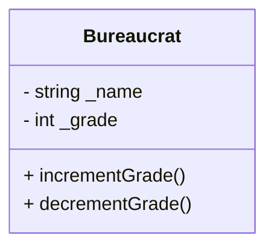
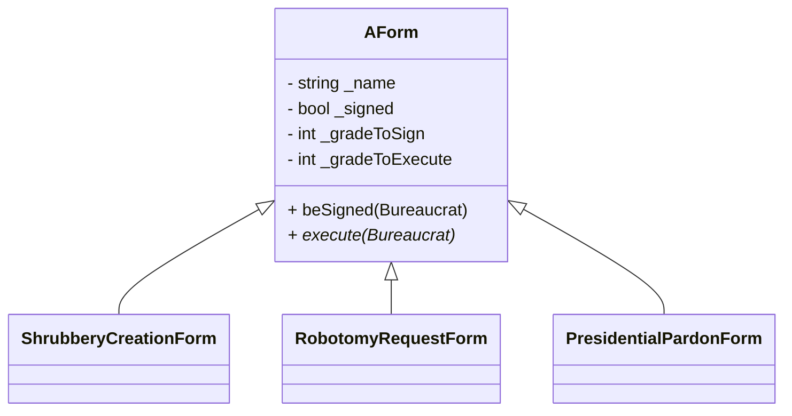
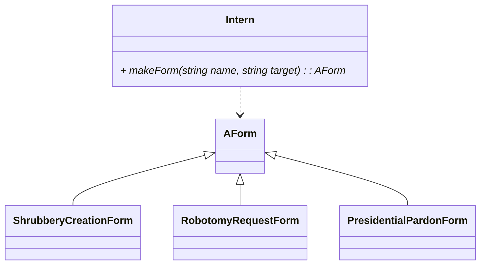

## Patrones de diseño en cpp05 (ex00–ex03)

Este documento relaciona cada ejercicio del módulo `cpp05` con patrones de diseño y principios SOLID. Las explicaciones están en castellano y los ejemplos de código en inglés (C++98). Se incluyen diagramas Mermaid donde aporte claridad.

### Índice
- ex00: Encapsulación robusta, Invariantes de clase, Fail-Fast
- ex01: Template Method + Command (intención), Separación de responsabilidades
- ex02: Polimorfismo + Template Method, Null Object (opcional), RAII en ejecución
- ex03: Factory Method (Intern), Registry con array de punteros a función, Open/Closed

---

### ex00 — Bureaucrat: Encapsulación robusta + Invariantes de clase
Patrones/Principios:
- Encapsulación de estado y validación (invariante de `grade` entre 1 y 150)
- Fail-Fast: lanzar excepciones en constructores/mutadores si se viola el rango
- SRP (Single Responsibility): `Bureaucrat` sólo gestiona su grado y representación

Puntos clave:
- Guardar el estado siempre válido. Métodos `incrementGrade`/`decrementGrade` protegen la invariante.
- Excepciones específicas: `GradeTooHighException` y `GradeTooLowException`.

```cpp
// Example (C++98): Bureaucrat invariant guard
void Bureaucrat::incrementGrade() {
    if (_grade <= 1) throw GradeTooHighException();
    _grade -= 1;
}

void Bureaucrat::decrementGrade() {
    if (_grade >= 150) throw GradeTooLowException();
    _grade += 1;
}
```

Mermaid (clase simplificada):


---

### ex01 — Form: Template Method (intención) y separación de responsabilidades
Patrones/Principios:
- Intención de Template Method: `Form` define pasos para firmar/ejecutar; detalles se especializan después (formalizado en ex02)
- SRP: `Bureaucrat` firma/ejecuta; `Form` valida requisitos (grados de firma/ejecución)
- LSP: Subclases de `Form` podrán reemplazar sin romper contratos (se consolida en ex02)

Puntos clave:
- Interacción coherente: `Bureaucrat.signForm(form)` y `form.beSigned(bureaucrat)`.

```cpp
// Example (C++98): sign interaction
void Bureaucrat::signForm(Form &f) {
    try { f.beSigned(*this); std::cout << _name << " signed " << f.getName() << std::endl; }
    catch (std::exception const &e) { std::cout << _name << " couldn't sign " << f.getName() << " because " << e.what() << std::endl; }
}
```

---

### ex02 — AForm y subclases: Template Method + Polimorfismo
Patrones/Principios:
- Template Method: `AForm::execute(bureaucrat)` define esqueleto (checks comunes), y delega la acción concreta a `execute` de la subclase.
- Polimorfismo: `Bureaucrat` opera con `AForm&` sin conocer la subclase concreta.
- RAII/Responsabilidad clara: cada `execute` debe dejar el sistema en estado consistente (crear archivo, imprimir, etc.).

Diagrama Mermaid:


```cpp
// Example (C++98): Template Method essence
void AForm::execute(Bureaucrat const &executor) const {
    if (!getSigned()) throw FormException();
    if (executor.getGrade() > getGradeToExecute()) throw GradeTooLowException();
    // Subclass performs the concrete action (in its own execute override)
}
```

---

### ex03 — Intern: Factory Method con registro de constructores
Patrones/Principios:
- Factory Method: `Intern::makeForm(name, target)` decide qué subclase instanciar.
- Registro con array de punteros a función: simplifica `if/else` múltiples y es extensible.
- OCP (Open/Closed): añadir nuevas `Form` requiere registrar un nuevo par (nombre, creador) sin tocar la lógica del `Intern`.

Diagrama Mermaid:


```cpp
// Example (C++98): Factory Method via table
typedef AForm* (*Creator)(std::string const &);

static AForm* createShrub(std::string const &t){ return new ShrubberyCreationForm(t); }
static AForm* createRobo(std::string const &t){ return new RobotomyRequestForm(t); }
static AForm* createPardon(std::string const &t){ return new PresidentialPardonForm(t); }

AForm* Intern::makeForm(std::string const &name, std::string const &target) {
    const std::string keys[3] = { "shrubbery creation", "robotomy request", "presidential pardon" };
    Creator creators[3] = { &createShrub, &createRobo, &createPardon };
    for (int i = 0; i < 3; ++i) if (name == keys[i]) return creators[i](target);
    std::cout << "Unknown form: " << name << std::endl; return NULL;
}
```

---

### Resumen de mapeo ejercicios → patrones
- ex00: Encapsulación fuerte, Fail-Fast, SRP
- ex01: (Pre) Template Method, SRP
- ex02: Template Method completo + Polimorfismo
- ex03: Factory Method (tabla de constructores) + OCP

### Buenas prácticas complementarias (presentación)
- Usar excepciones específicas y mensajes claros en `what()`.
- Mantener interfaces estables (`AForm`) y depender de abstracciones.
- C++98 compat: cast explícito para `std::srand(std::time(0))` y evitar características modernas.
- RAII: liberar memoria de `new` (ej.: `delete` tras usar `Intern::makeForm`).

```mermaid
flowchart TD
    B(Bureaucrat) -->|signForm/executeForm| AF[AForm]
    AF -->|polymorphic execute| F1[Shrubbery]
    AF --> F2[Robotomy]
    AF --> F3[Pardon]
    I[Intern] -->|makeForm(name,target)| AF
```


