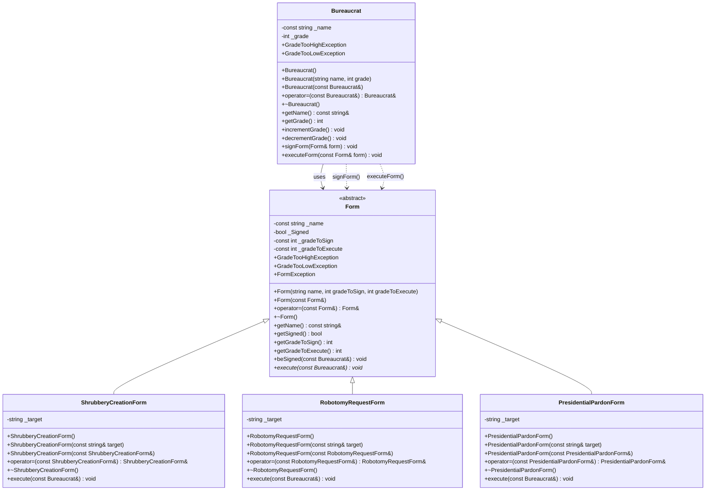
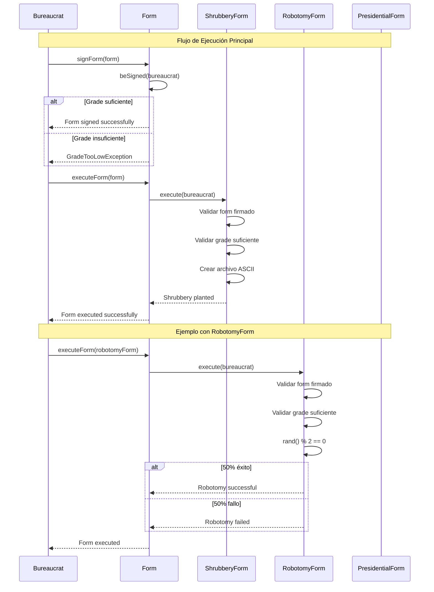
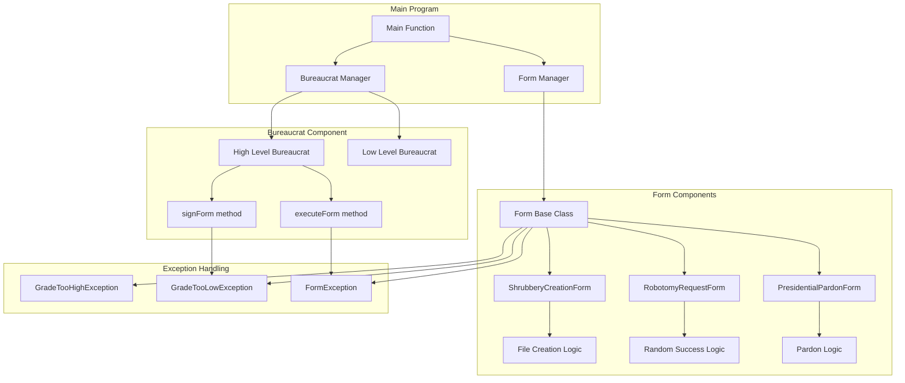
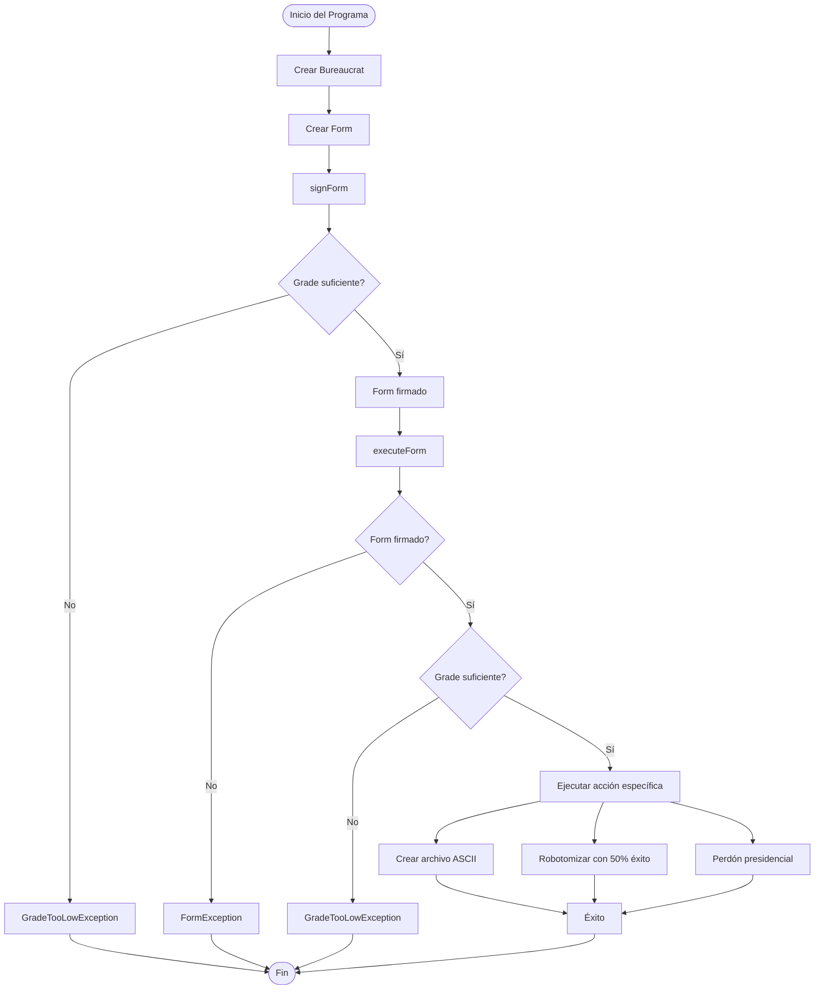
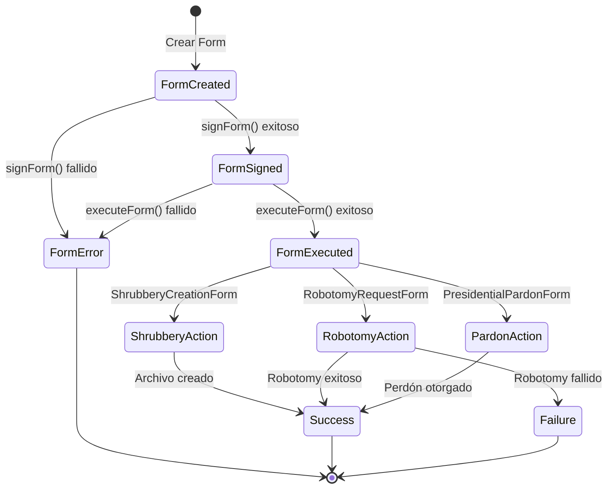
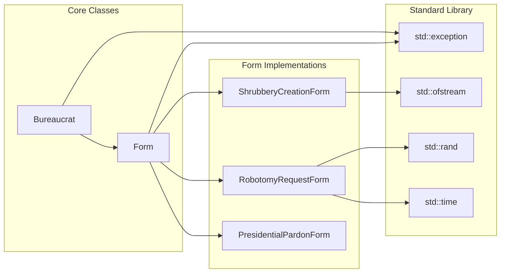
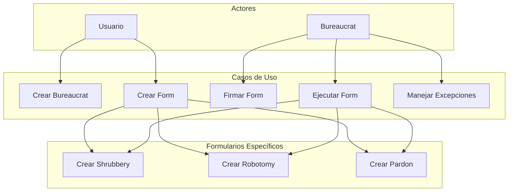
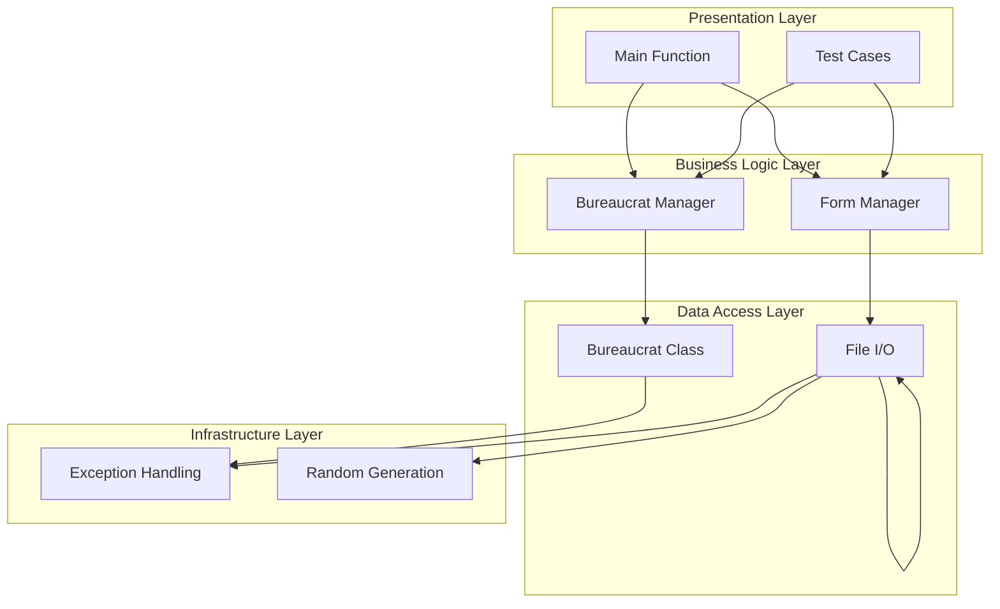

# DIAGRAMA UML - EJERCICIO EX02 (CPP05) - FORMATO MERMAID

## 📊 **DIAGRAMA DE CLASES PRINCIPAL**

## 🔄 **DIAGRAMA DE SECUENCIA**

## 🏗️ **DIAGRAMA DE COMPONENTES**

## 🔄 **DIAGRAMA DE FLUJO DE DATOS**

## 🎯 **DIAGRAMA DE ESTADOS**

## 🔗 **DIAGRAMA DE DEPENDENCIAS**

## 📊 **DIAGRAMA DE CASOS DE USO**

## 🎨 **DIAGRAMA DE ARQUITECTURA**

