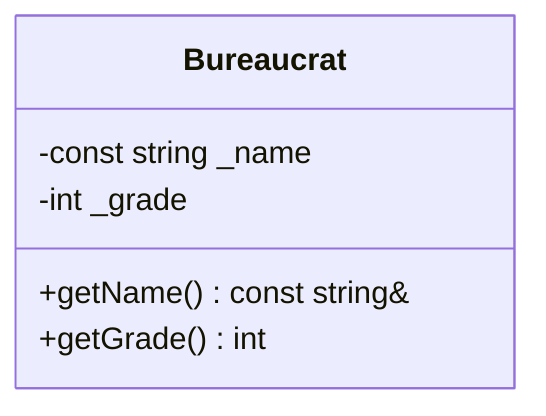

# DIAGRAMA UML - EJERCICIO EX02 (CPP05) - FORMATO MERMAID

## 📊 **DIAGRAMA DE CLASES PRINCIPAL**


## 🔄 **DIAGRAMA DE SECUENCIA**


## 🏗️ **DIAGRAMA DE COMPONENTES**


## 🔄 **DIAGRAMA DE FLUJO DE DATOS**

```mermaid
flowchart TD
    Start([Inicio del Programa]) --> CreateB[Crear Bureaucrat]
    CreateB --> CreateF[Crear Form]
    CreateF --> Sign[signForm]
    
    Sign --> CheckGrade{Grade suficiente?}
    CheckGrade -->|Sí| SignSuccess[Form firmado]
    CheckGrade -->|No| SignError[GradeTooLowException]
    
    SignSuccess --> Execute[executeForm]
    Execute --> CheckSigned{Form firmado?}
    CheckSigned -->|No| FormError[FormException]
    CheckSigned -->|Sí| CheckGrade2{Grade suficiente?}
    
    CheckGrade2 -->|No| GradeError[GradeTooLowException]
    CheckGrade2 -->|Sí| ExecuteAction[Ejecutar acción específica]
    
    ExecuteAction --> Shrubbery[Crear archivo ASCII]
    ExecuteAction --> Robotomy[Robotomizar con 50% éxito]
    ExecuteAction --> Pardon[Perdón presidencial]
    
    Shrubbery --> Success[Éxito]
    Robotomy --> Success
    Pardon --> Success
    
    SignError --> End([Fin])
    FormError --> End
    GradeError --> End
    Success --> End
```



## 🎯 **DIAGRAMA DE ESTADOS**

```mermaid
stateDiagram-v2
    [*] --> FormCreated: Crear Form
    FormCreated --> FormSigned: signForm() exitoso
    FormCreated --> FormError: signForm() fallido
    
    FormSigned --> FormExecuted: executeForm() exitoso
    FormSigned --> FormError: executeForm() fallido
    
    FormExecuted --> ShrubberyAction: ShrubberyCreationForm
    FormExecuted --> RobotomyAction: RobotomyRequestForm
    FormExecuted --> PardonAction: PresidentialPardonForm
    
    ShrubberyAction --> Success: Archivo creado
    RobotomyAction --> Success: Robotomy exitoso
    RobotomyAction --> Failure: Robotomy fallido
    PardonAction --> Success: Perdón otorgado
    
    FormError --> [*]
    Success --> [*]
    Failure --> [*]
```



## 🔗 **DIAGRAMA DE DEPENDENCIAS**


## 📊 **DIAGRAMA DE CASOS DE USO**


## 🎨 **DIAGRAMA DE ARQUITECTURA**


## 📝 **INSTRUCCIONES DE USO**

### **Para usar estos diagramas:**

1. **Copia el código Mermaid** de cualquier sección
2. **Pega en un editor que soporte Mermaid** como:
   - GitHub (en archivos .md)
   - GitLab
   - Notion
   - Mermaid Live Editor (https://mermaid.live/)
   - VS Code con extensión Mermaid

### **Ejemplo de uso en GitHub:**
```markdown


### **Herramientas recomendadas:**
- **Mermaid Live Editor**: https://mermaid.live/
- **VS Code**: Extensión "Mermaid Preview"
- **GitHub**: Soporte nativo en archivos .md
- **GitLab**: Soporte nativo en archivos .md

---

*Estos diagramas Mermaid proporcionan una representación visual completa del ejercicio ex02, incluyendo clases, relaciones, flujos de ejecución y arquitectura del sistema.*
