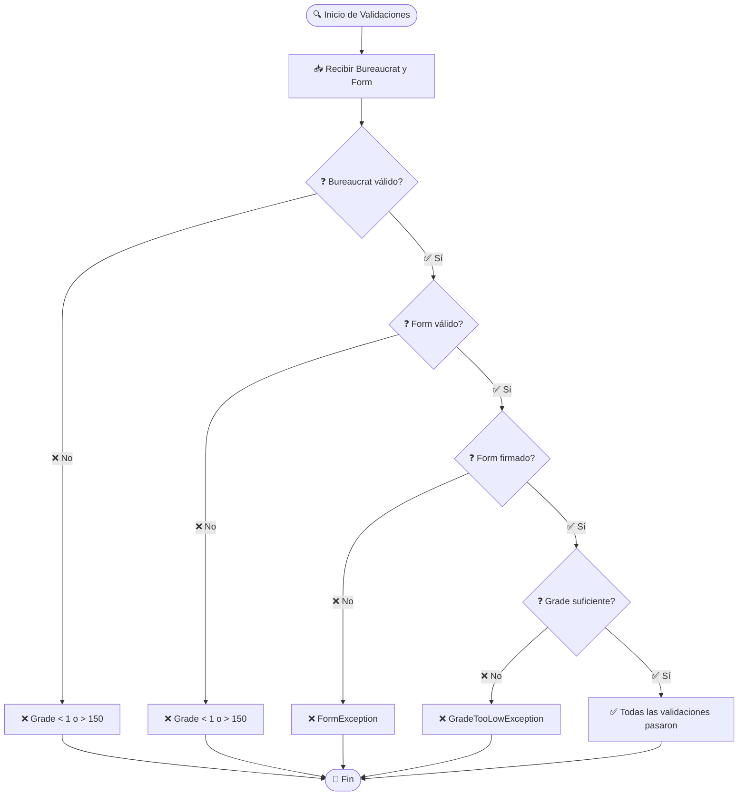
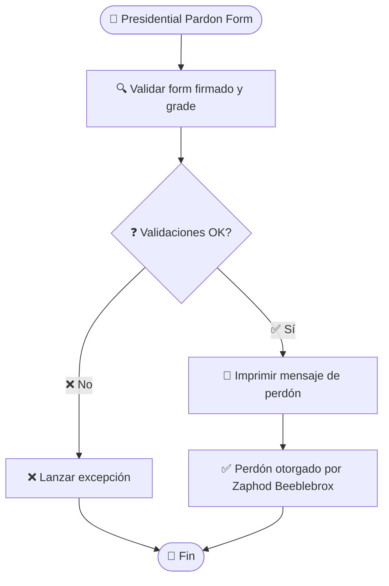
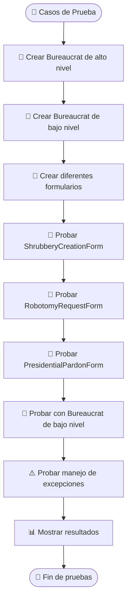
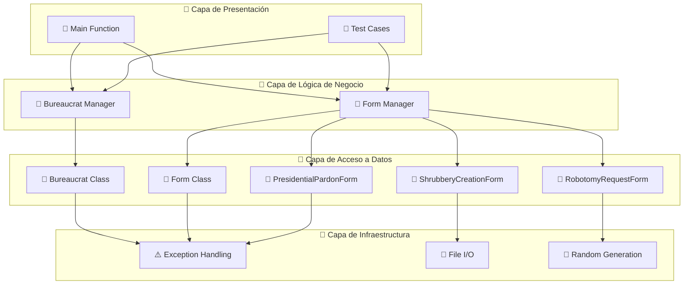

# FLOWCHARTS - EJERCICIO EX02 (CPP05)

## 🔄 **FLOWCHART PRINCIPAL DEL PROGRAMA**


## 🎯 **FLOWCHART DE VALIDACIONES**



## 🌳 **FLOWCHART DE SHRUBBERY CREATION FORM**


## 🤖 **FLOWCHART DE ROBOTOMY REQUEST FORM**

```mermaid
flowchart TD
    Start([🤖 Robotomy Request Form]) --> Validate[🔍 Validar form firmado y grade]
    Validate --> CheckValid{❓ Validaciones OK?}
    
    CheckValid -->|❌ No| ThrowException[❌ Lanzar excepción]
    CheckValid -->|✅ Sí| SeedRandom[🎲 Inicializar generador aleatorio]
    
    SeedRandom --> GenerateRandom[🎯 Generar número aleatorio]
    GenerateRandom --> CheckRandom{❓ rand() % 2 == 0?}
    
    CheckRandom -->|✅ Sí| Success[✅ Robotomy exitoso]
    CheckRandom -->|❌ No| Failure[💥 Robotomy fallido]
    
    ThrowException --> End([🏁 Fin])
    Success --> End
    Failure --> End
```

## 👑 **FLOWCHART DE PRESIDENTIAL PARDON FORM**



## 🔧 **FLOWCHART DE MANEJO DE EXCEPCIONES**

```mermaid
flowchart TD
    Start([⚠️ Manejo de Excepciones]) --> TryBlock[🔄 Bloque try]
    TryBlock --> Operation[⚡ Operación (sign/execute)]
    
    Operation --> CheckException{❓ ¿Excepción lanzada?}
    CheckException -->|❌ No| Success[✅ Operación exitosa]
    CheckException -->|✅ Sí| CatchBlock[🛡️ Bloque catch]
    
    CatchBlock --> CheckType{❓ ¿Tipo de excepción?}
    CheckType -->|GradeTooHigh| HighException[❌ GradeTooHighException]
    CheckType -->|GradeTooLow| LowException[❌ GradeTooLowException]
    CheckType -->|FormNotSigned| FormException[❌ FormException]
    
    HighException --> PrintError[📢 Imprimir mensaje de error]
    LowException --> PrintError
    FormException --> PrintError
    
    PrintError --> End([🏁 Fin])
    Success --> End
```

## 🎮 **FLOWCHART DE CASOS DE PRUEBA**



## 🔄 **FLOWCHART DE CICLO DE VIDA DEL FORM**

```mermaid
flowchart TD
    Start([🔄 Ciclo de Vida del Form]) --> Create[📄 Crear Form]
    Create --> Initialize[🔧 Inicializar atributos]
    Initialize --> SetUnsigned[❌ _Signed = false]
    
    SetUnsigned --> WaitForSign[⏳ Esperar a ser firmado]
    WaitForSign --> SignForm[✍️ signForm()]
    
    SignForm --> CheckGrade{❓ Grade suficiente?}
    CheckGrade -->|❌ No| SignError[❌ GradeTooLowException]
    CheckGrade -->|✅ Sí| SetSigned[✅ _Signed = true]
    
    SetSigned --> WaitForExecute[⏳ Esperar a ser ejecutado]
    WaitForExecute --> ExecuteForm[⚡ executeForm()]
    
    ExecuteForm --> CheckSigned{❓ Form firmado?}
    CheckSigned -->|❌ No| ExecuteError[❌ FormException]
    CheckSigned -->|✅ Sí| CheckGrade2{❓ Grade suficiente?}
    
    CheckGrade2 -->|❌ No| GradeError[❌ GradeTooLowException]
    CheckGrade2 -->|✅ Sí| ExecuteAction[🎯 Ejecutar acción específica]
    
    ExecuteAction --> Complete[✅ Form completado]
    
    SignError --> End([🏁 Fin])
    ExecuteError --> End
    GradeError --> End
    Complete --> End
```

## 📊 **FLOWCHART DE ARQUITECTURA DEL SISTEMA**



## 🎨 **FLOWCHART DE PATRONES DE DISEÑO**

```mermaid
flowchart TD
    Start([🎨 Patrones de Diseño]) --> TemplateMethod[📋 Template Method Pattern]
    TemplateMethod --> Strategy[🎯 Strategy Pattern]
    Strategy --> RAII[🛡️ RAII Pattern]
    
    TemplateMethod --> FormBase[📄 Form (Clase Base)]
    FormBase --> DefineAlgorithm[🔧 Define algoritmo en execute()]
    DefineAlgorithm --> DerivedClasses[📄 Clases derivadas implementan]
    
    Strategy --> DifferentForms[📄 Diferentes tipos de Form]
    DifferentForms --> ShrubberyStrategy[🌳 Estrategia Shrubbery]
    DifferentForms --> RobotomyStrategy[🤖 Estrategia Robotomy]
    DifferentForms --> PardonStrategy[👑 Estrategia Pardon]
    
    RAII --> ResourceManagement[🔧 Gestión automática de recursos]
    ResourceManagement --> Destructors[🗑️ Destructores automáticos]
    Destructors --> MemorySafety[🛡️ Seguridad de memoria]
    
    ShrubberyStrategy --> End([🏁 Fin])
    RobotomyStrategy --> End
    PardonStrategy --> End
    MemorySafety --> End
```

## 📝 **INSTRUCCIONES DE USO**

### **Para ver estos flowcharts:**

1. **GitHub/GitLab**: Los diagramas se renderizan automáticamente
2. **VS Code**: Instala "Mermaid Preview" extension
3. **Mermaid Live Editor**: https://mermaid.live/
4. **Notion**: Soporte nativo para Mermaid

### **Ventajas de estos flowcharts:**

- ✅ **Visual**: Fácil de entender el flujo
- ✅ **Interactivo**: Se puede hacer zoom y navegar
- ✅ **Editable**: Fácil de modificar
- ✅ **Portable**: Funciona en múltiples plataformas
- ✅ **Versionable**: Se puede trackear en Git

### **Símbolos utilizados:**

- 🚀 **Inicio/Fin**: Puntos de entrada y salida
- ❓ **Decisión**: Puntos de decisión
- ✅ **Éxito**: Operaciones exitosas
- ❌ **Error**: Manejo de errores
- 🔄 **Proceso**: Operaciones intermedias
- 📄 **Datos**: Formularios y documentos
- 👤 **Actor**: Bureaucrat
- 🎯 **Acción**: Operaciones específicas

---

*Estos flowcharts proporcionan una representación visual completa del flujo de ejecución del ejercicio ex02, incluyendo validaciones, manejo de excepciones y patrones de diseño.*
