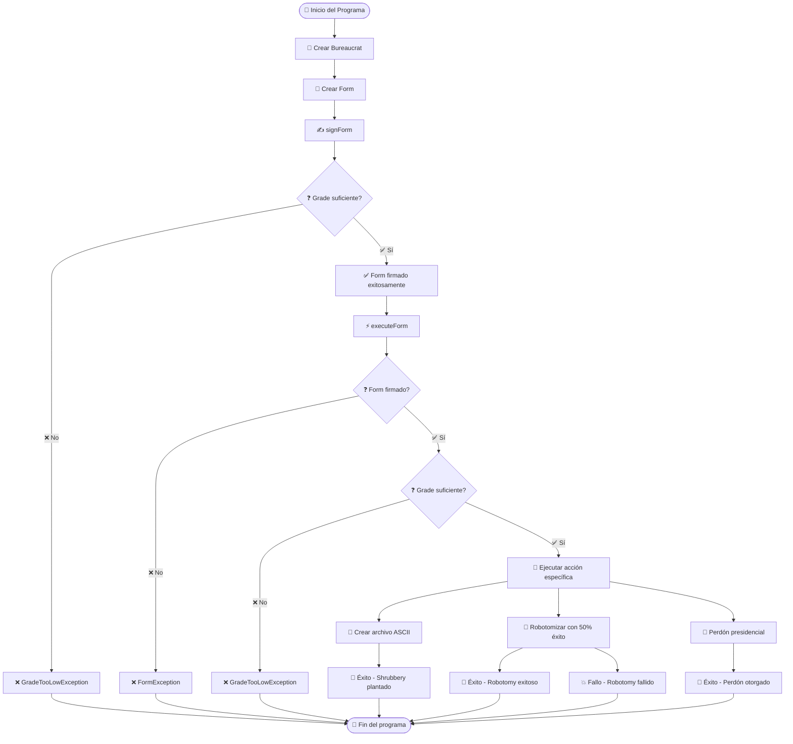
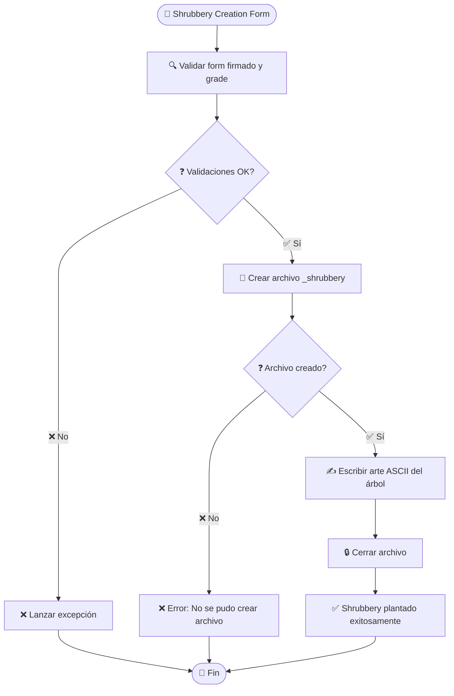
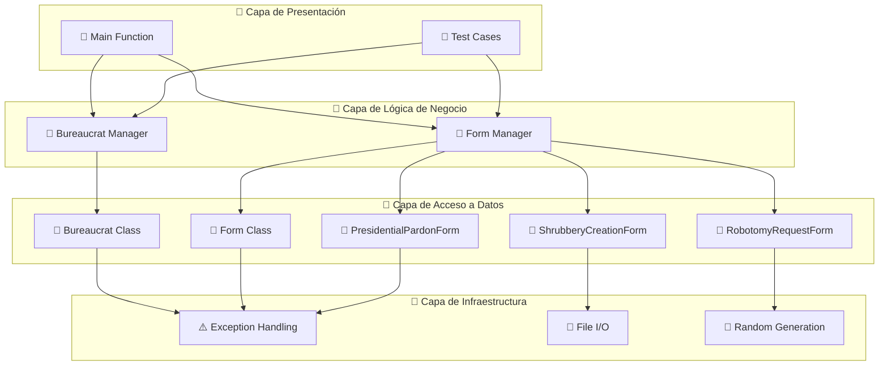

# FLOWCHARTS - EJERCICIO EX02 (CPP05)

## 🔄 **FLOWCHART PRINCIPAL DEL PROGRAMA**

## 🎯 **FLOWCHART DE VALIDACIONES**

## 🌳 **FLOWCHART DE SHRUBBERY CREATION FORM**

## 🎮 **FLOWCHART DE CASOS DE PRUEBA**

## 📊 **FLOWCHART DE ARQUITECTURA DEL SISTEMA**

