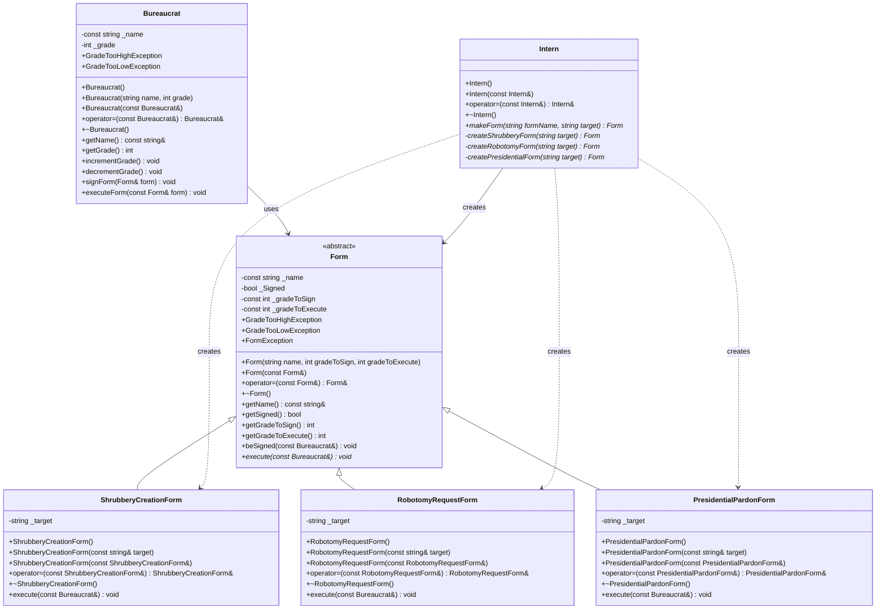
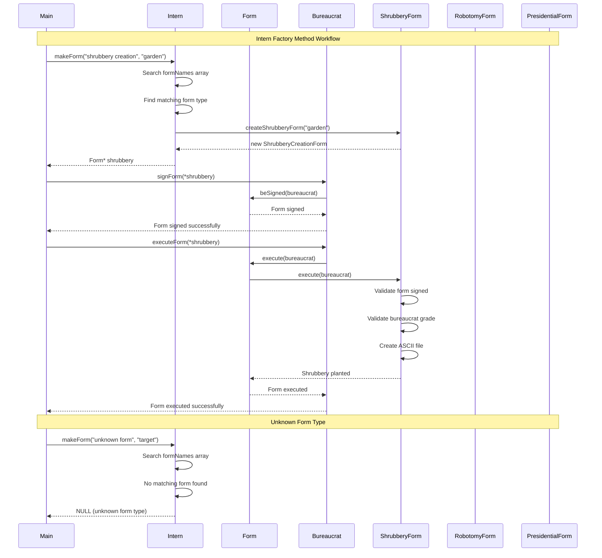
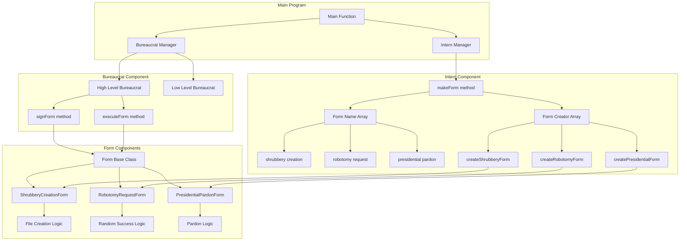
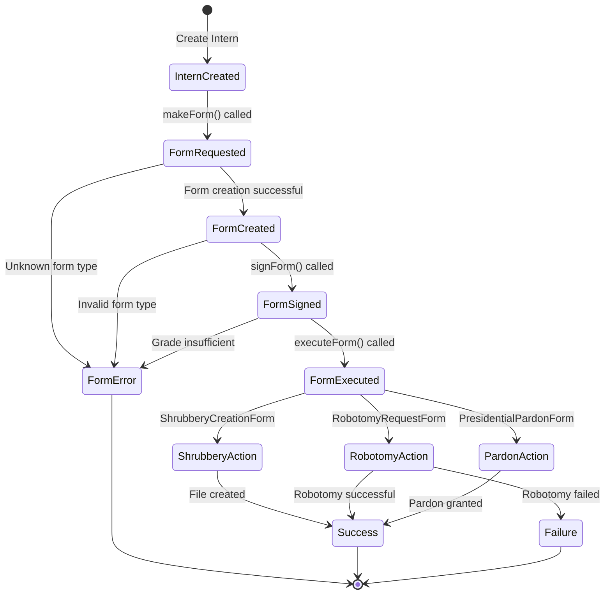
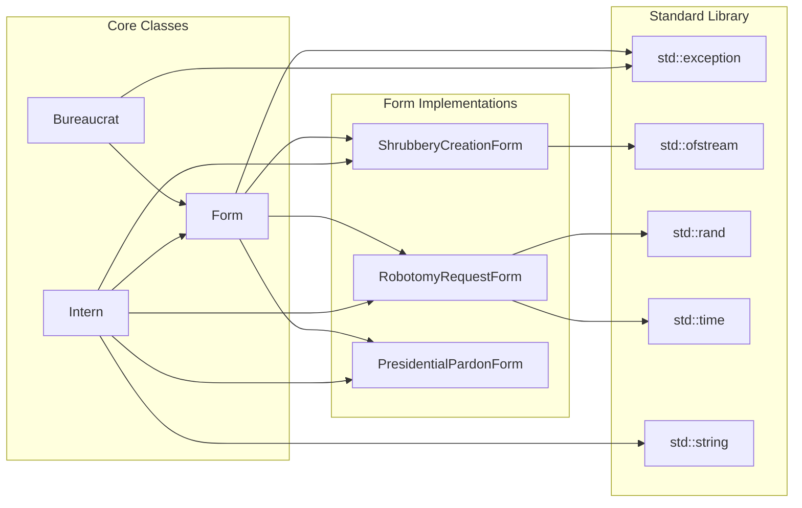
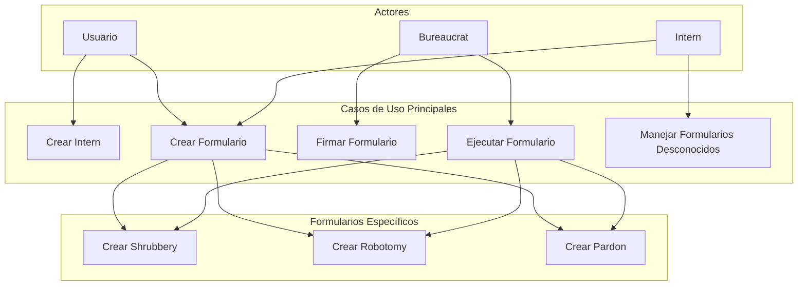
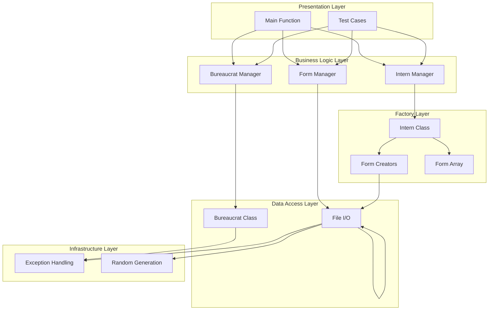
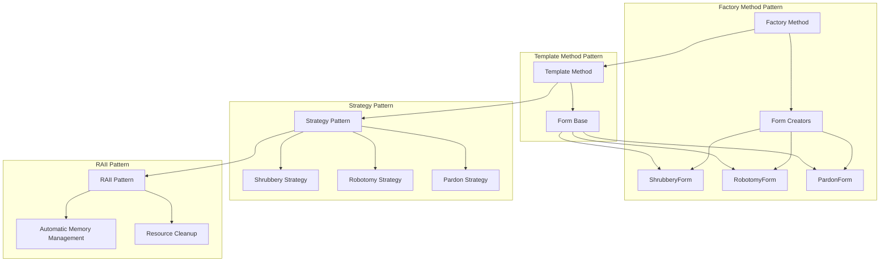

# DIAGRAMA UML - EJERCICIO EX03 (CPP05) - INTERN Y FACTORY METHOD

## 📊 **DIAGRAMA DE CLASES PRINCIPAL**



## 🔄 **DIAGRAMA DE SECUENCIA - INTERN WORKFLOW**



## 🏗️ **DIAGRAMA DE COMPONENTES - INTERN ARCHITECTURE**



## 🔄 **DIAGRAMA DE FLUJO - INTERN FACTORY METHOD**

```mermaid
flowchart TD
    Start([🚀 makeForm called]) --> Input[📥 Receive formName and target]
    Input --> Search[🔍 Search formNames array]
    Search --> CheckMatch{❓ Form name found?}
    
    CheckMatch -->|✅ Yes| GetIndex[📍 Get array index]
    CheckMatch -->|❌ No| UnknownForm[❌ Unknown form type]
    
    GetIndex --> CallCreator[🎯 Call formCreators[index]]
    CallCreator --> CreateForm[📄 Create specific form]
    
    CreateForm --> Shrubbery[🌳 ShrubberyCreationForm]
    CreateForm --> Robotomy[🤖 RobotomyRequestForm]
    CreateForm --> Pardon[👑 PresidentialPardonForm]
    
    Shrubbery --> Success[✅ Form created successfully]
    Robotomy --> Success
    Pardon --> Success
    
    UnknownForm --> PrintError[📢 Print error message]
    PrintError --> ReturnNull[🔙 Return NULL]
    
    Success --> PrintSuccess[📢 Print success message]
    PrintSuccess --> ReturnForm[🔙 Return Form*]
    
    ReturnNull --> End([🏁 End])
    ReturnForm --> End
```

## 🎯 **DIAGRAMA DE ESTADOS - FORM LIFECYCLE WITH INTERN**



## 🔗 **DIAGRAMA DE DEPENDENCIAS - INTERN SYSTEM**



## 📊 **DIAGRAMA DE CASOS DE USO - INTERN SYSTEM**



## 🎨 **DIAGRAMA DE ARQUITECTURA - INTERN PATTERN**



## 🎯 **DIAGRAMA DE PATRONES DE DISEÑO**



## 📝 **INSTRUCCIONES DE USO**

### **Para ver estos diagramas:**

1. **GitHub/GitLab**: Los diagramas se renderizan automáticamente
2. **VS Code**: Instala "Mermaid Preview" extension
3. **Mermaid Live Editor**: https://mermaid.live/
4. **Notion**: Soporte nativo para Mermaid

### **Ventajas de estos diagramas:**

- ✅ **Visual**: Fácil de entender la arquitectura
- ✅ **Interactivo**: Se puede hacer zoom y navegar
- ✅ **Editable**: Fácil de modificar
- ✅ **Portable**: Funciona en múltiples plataformas
- ✅ **Versionable**: Se puede trackear en Git

### **Símbolos utilizados:**

- 🚀 **Inicio/Fin**: Puntos de entrada y salida
- ❓ **Decisión**: Puntos de decisión
- ✅ **Éxito**: Operaciones exitosas
- ❌ **Error**: Manejo de errores
- 🔄 **Proceso**: Operaciones intermedias
- 📄 **Datos**: Formularios y documentos
- 👤 **Actor**: Bureaucrat
- 🎯 **Acción**: Operaciones específicas
- 🏭 **Factory**: Intern como factory

---

*Estos diagramas UML proporcionan una representación visual completa del ejercicio ex03, incluyendo el patrón Factory Method, la clase Intern, y todas las relaciones entre componentes.*
