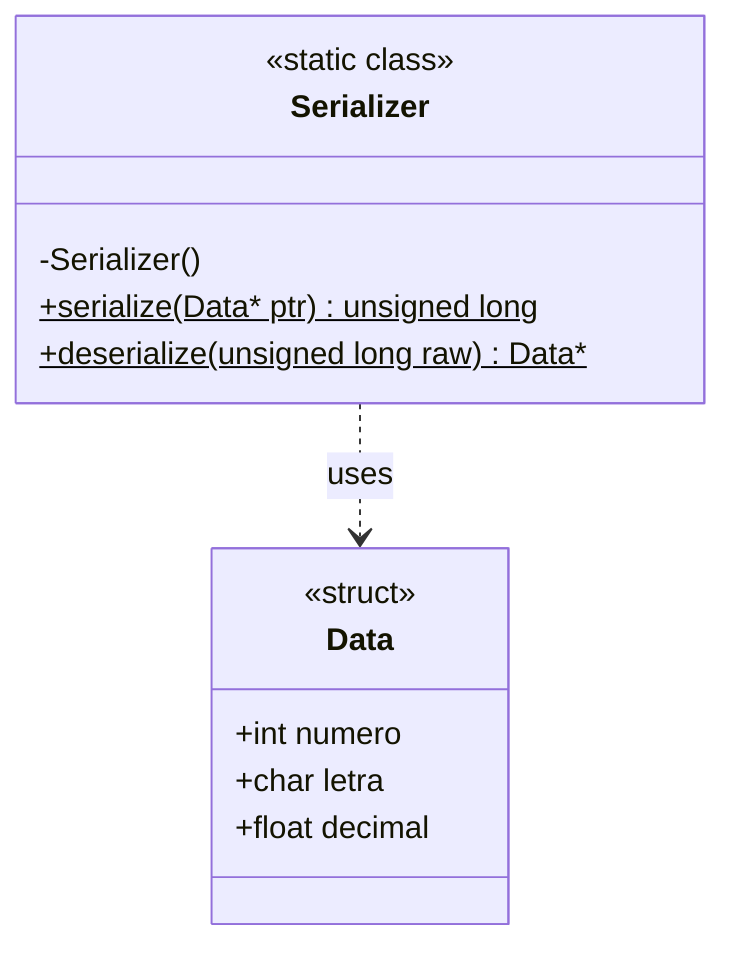
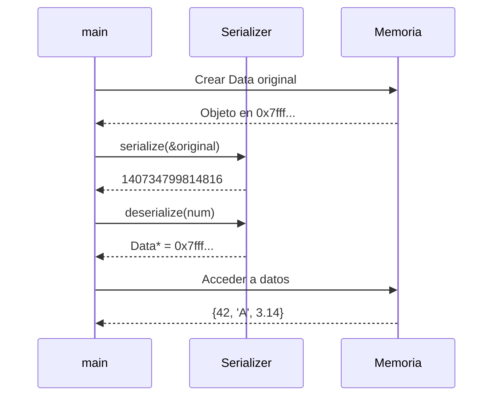
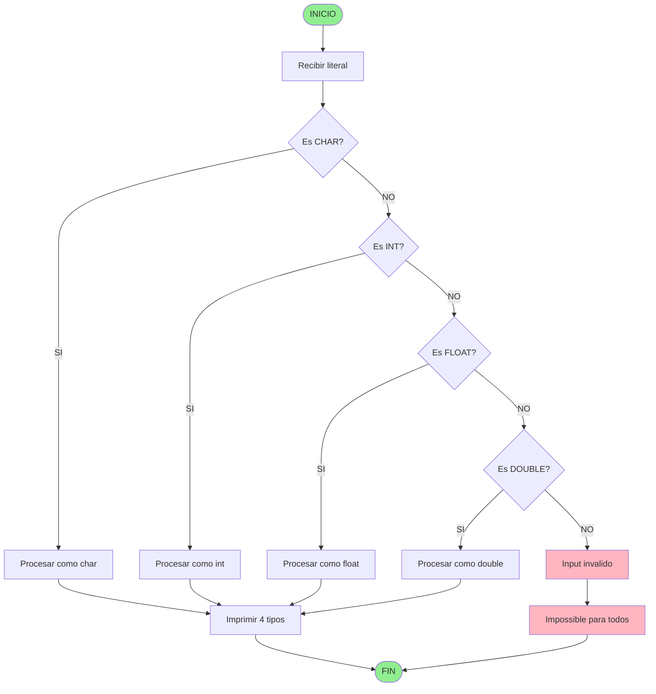
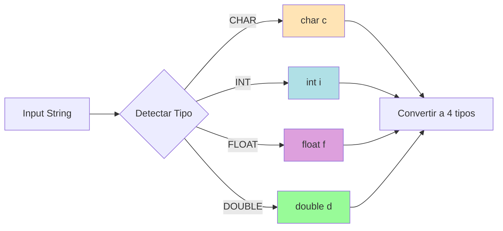
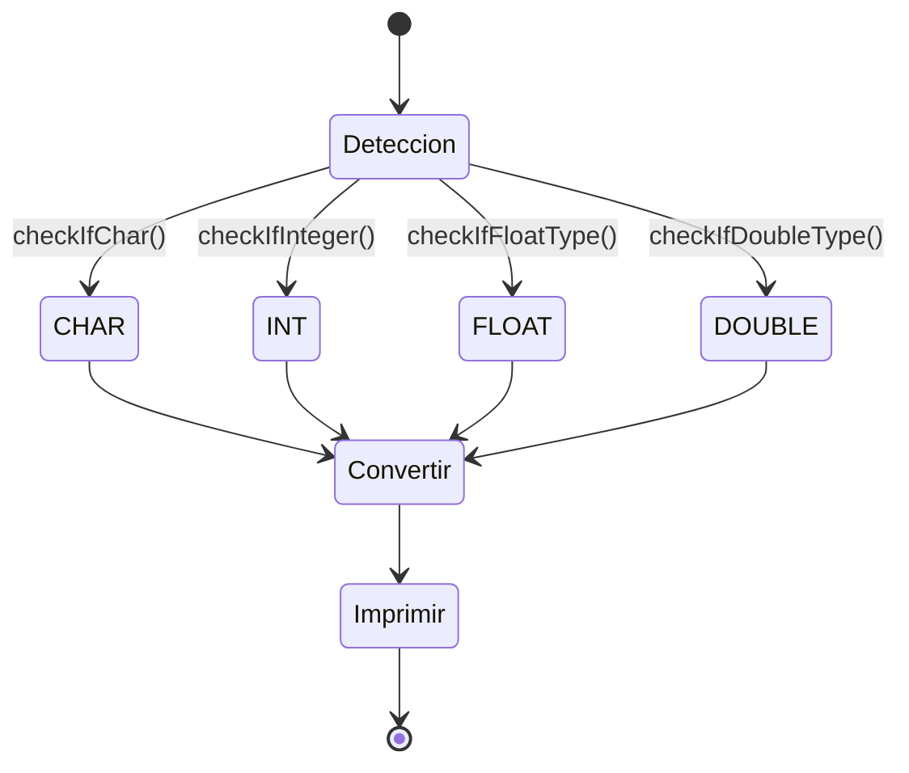
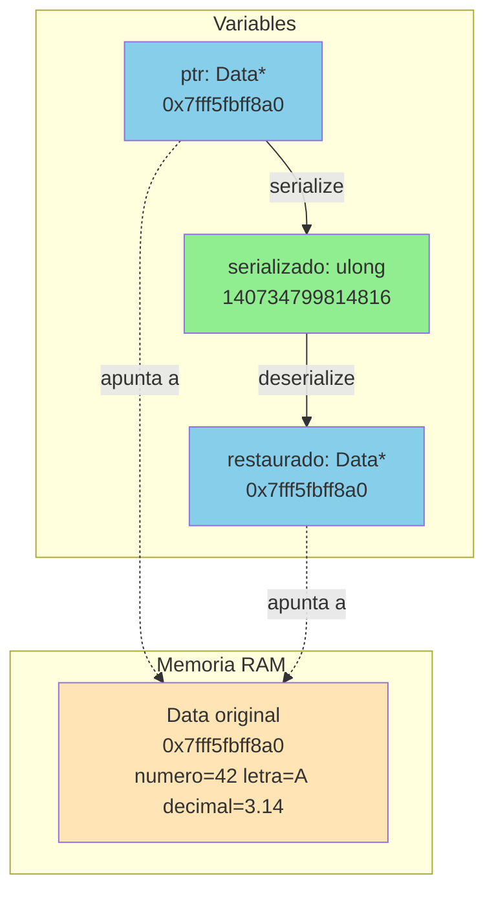
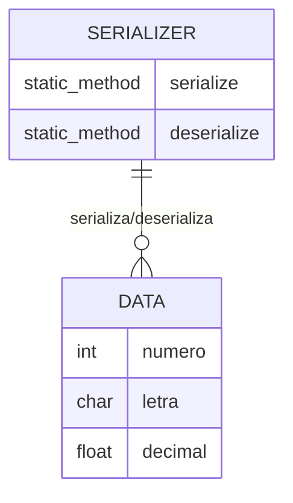

# 🧪 PRUEBA DE DIAGRAMAS MERMAID

> **Instrucciones**: Abre este archivo en **Preview Mode** (Cmd+Shift+V en VSCode/Cursor)

---

---

## 1️⃣ Diagrama Simple - Flujo Básico
```mermaid
flowchart TD
    Start[Inicio] --> Check{Condición}
    Check -->|Sí| Yes[Opción SI]
    Check -->|No| No[Opción NO]
    Yes --> End[Fin]
    No --> End


---

## 2️⃣ Diagrama de Clases - ScalarConverter

```mermaid
classDiagram
    class ScalarConverter {
        -ScalarConverter()
        -ScalarConverter(const ScalarConverter&)
        -operator=(const ScalarConverter&)
        -~ScalarConverter()
        +convert(string literal)$ void
    }
```

---

## 3️⃣ Diagrama de Clases - Serializer



---

## 4️⃣ Diagrama de Secuencia - Serialización



---

## 5️⃣ Diagrama de Flujo - ScalarConverter Convert



---

## 6️⃣ Diagrama con Colores - Tipos de Datos



---

## 7️⃣ Diagrama de Estado - Conversión



---

## 8️⃣ Diagrama de Gantt - Proceso de Conversión

```mermaid
gantt
    title Proceso ScalarConverter
    dateFormat X
    axisFormat %s
    
    section Detección
    checkIfChar      :0, 1s
    checkIfInteger   :1s, 1s
    checkIfFloatType :2s, 1s
    checkIfDoubleType:3s, 1s
    
    section Conversión
    Parsear valor    :4s, 2s
    Validar rango    :6s, 1s
    
    section Output
    displayCharType  :7s, 1s
    displayIntType   :8s, 1s
    displayFloatType :9s, 1s
    displayDoubleType:10s, 1s
```

---

## 9️⃣ Diagrama de Memoria - Serialización



---

## 🔟 Diagrama ER - Relación entre Clases



---


